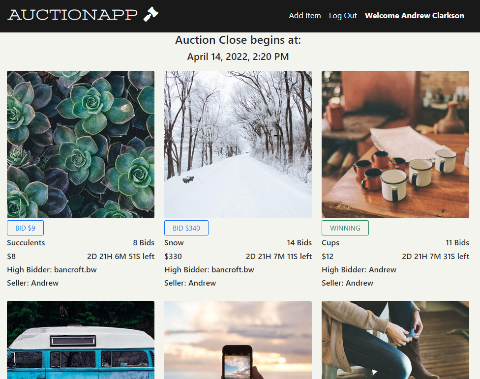

# Auction App - MERN Stack

[DEMO LINK - hosted on Heroku Free Dyno, may take up to 30 seconds to spin up](https://react-auction-app.herokuapp.com/)

## Description

The Auction App is a full stack project I built with the MERN Stack to show off the skills I have learned while completing [_The Complete 2022 Web Development Bootcamp_ at **The App Brewery**](https://www.udemy.com/course/the-complete-web-development-bootcamp/).

## Technologies Used

- JavaScript ES6+
- JSX
- MongoDB (Mongoose and Atlas)
- Express
- React (Components, Hooks)
- Node
- Bootstrap 5
- Passport.js with Google OAuth
- Heroku
- Git and Github

## Features

- User Authentication: Registration and Login
- Bid on existing items
- Add/Edit/Delete items
- Fully Responsive
- Staggered item closing with countdown

## Lessons Learned During Development

- A detailed plan is essential to efficient development
- Connecting React to Node/Express to create full stack app
- Local and Google authentication with Passport.js
- Heroku deployment of multiple servers
- Bootstrap Modals
- Creating unique IDs with uuid
- Commit regularly and don't be afraid to roll back
- Patience while chasing a particularly elusive bug

## Planned Features

- Watch List
- Winning/Outbid list
- Email notifications for outbid and auction close status
- Pushing other users bids immediately to update all users
- Proxy bidding
- Photo upload
- Multiple photos per listing
- Individual item pages
- User set username
- Better handling of money (Dinero.js)
- Soft closing
- Disable delete/edit after auction goes live
- Sign In/Register modal toggle
- Outbid label
- Image placeholder for invalid photo upload
- Listing App
- Payment gateway (including payment method required to bid)
